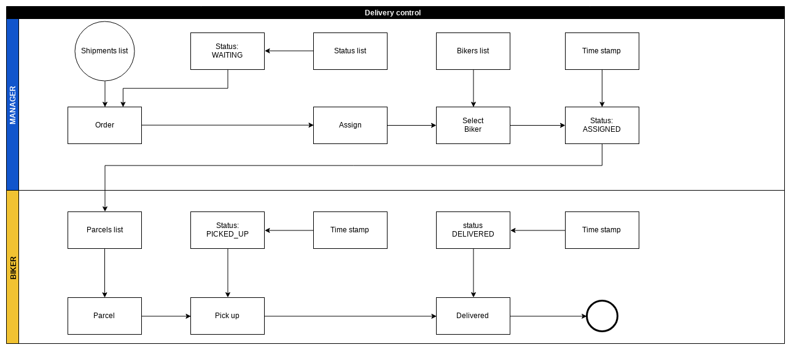
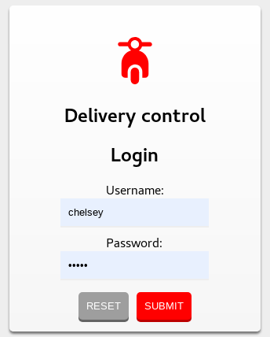
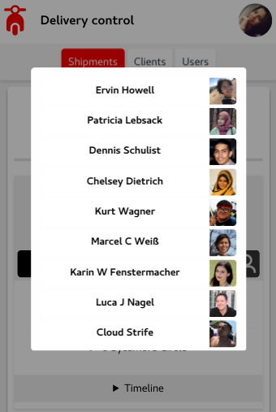
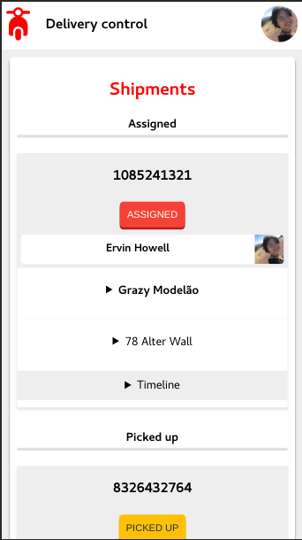
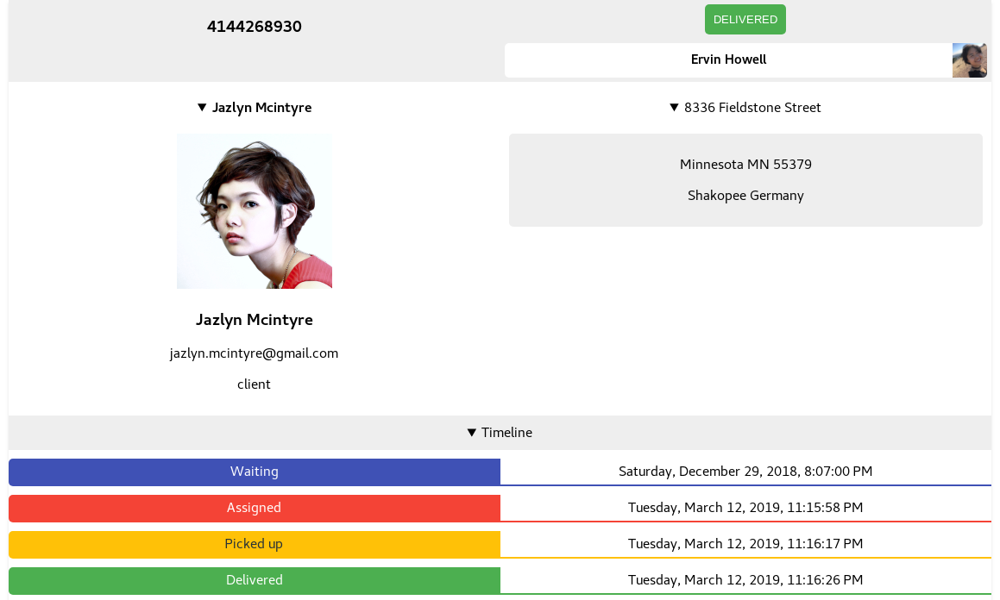

# Delivery control: Delivery management system, Node.js server, React client.

> Delivery management system, Node.js server, React client, JSON data, no persist data.

## Description

Delivery management system to assign and control the delivery of shipments.
Using Node.js as a server, React as a client, JSON as data (no persist data). Responsive design (without Bootstrap).

## Dependencies

Development environment:

- nodemon
  - `npm install nodemon --global`

## Install

`npm run dev-install`

- Install all dependencies in the development environment, client and server.

`npm run webpack-server-client-dev`

- Build client with webpack,
  run Node REST server on port 5000 and
  webpack-dev-server in development mode, hot reload,
  changing port to 3000 and host IP to 0.0.0.0 to be accessible on mobile in the same network.

### Other alternative scripts

`npm run start`

- Run concurrently Node server on port `5000` and client on port `3000`

`npm run webpack-build`

- Build client with webpack.

`npm run webpack-server-client`

- Build client with webpack, run server and webpack-dev-server
  in production mode and hot reload.

`npm run webpack-server-client-dev-2`

- Build client with webpack, run server and webpack-dev-server in development mode and hot reload.

`npm run client-server-install`

- Install dependencies on client and server.

`npm run client-install`

- Install dependencies on client.

`npm run server-install`

- Install dependencies on server.

`npm run client`

- Run react client with `react-scripts start`.

`npm run server`

- Run Node server with nodemon.

`npm run server-start`

- Run server without nodemon.

`npm run audit-fix`

- Run audit fix to fix all packages with vulnerabilities

## Users

| username | password |
| :------: | :------: |
|  admin   |  admin   |
|  biker   |  biker   |
| patricia |  biker   |
|  dennis  |  biker   |
| chelsey  |  biker   |
|   kurt   |  biker   |
|  marcel  |  biker   |
|  karin   |  biker   |
|   luca   |  biker   |
|  cloud   |  biker   |

## Workflow

## Screenshots

Login:

Admin:

Bikers list:

Biker (Delivery girl):

Shipment Delivered:

## Tested on

- OS: Debian GNU/Linux 9.6 (stretch)
  - BROWSERS:
    - Google Chrome: 71.0.3578.98 (Official Build) (64-bit)
      - Google Chrome: 73.0.3683.75 (Official Build) (64-bit)
    - Firefox: 60.4.0esr (64-bit)
    - Opera: 57.0.3098.106
  - IDE: Atom 1.33.0
- Device: Android 8.0.0:
  - BROWSERS:
    - Google Chrome: 71.0.3578.99
    - Firefox: 64.0.1
    - Opera: 49.2.2361.134358

## Meta

Full Stack Developer: [Jonimar Marques Policarpo](http://linkedin.com/treedbox "LinkEdin")

Twitter: [@treedbox](http://twitter.com/treedbox)

Skype: treedbox

Phone: +55 63 999771830

E-mail/Hangouts: [treedbox@gmail.com](mailto:treedbox@gmail.com)

Site: [treedbox.com](http://treedbox.com)

## License

[MIT](LICENSE.md) © [TreedBox](https://github.com/treedbox)
